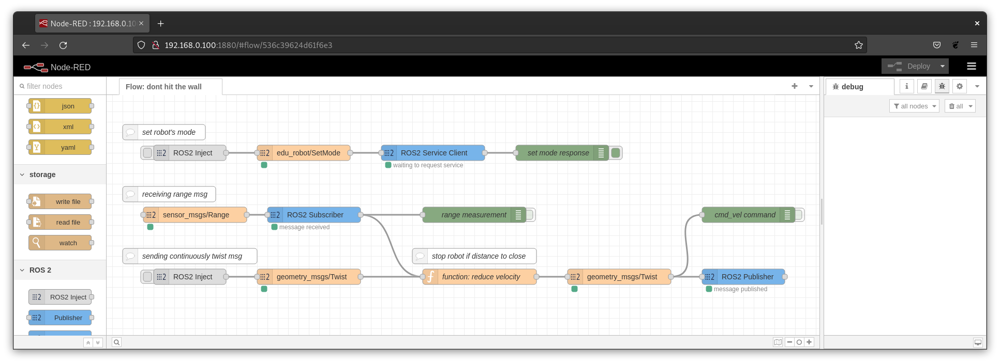

# Example: Don't hti the Wall

This example shows how a application using Node-Red could look like. It receives measurements from one of the distance sensors of the robot Eduard and reduces the sent velocity, which is also sent in this example, in case of a close distance.

If you simply want to try it you can use [this file](flow-example-dont-hit-the-wall.json) and import it into Node-Red using the import function.

Below all parts of the Node-Red flow are described part by part. The following figure shows an overview of the finished network:


## Set Mode

When using NodeRed you should always use the mode **AUTONOMOUS**. This mode has the number “4”. In the future the names of the modes not only the numbers will be usable in NodeRed. Lets work with “4” for now.

> **Note**: our robots got different modes. We highly recommend to use mode **AUTONOMOUS** for applications where the robot drives autonomously. This has the advantage that if you want to control the robot manually, e.g. because it is performing a destructive action, you can simply switch the mode to **REMOTE CONTROLLED**. This way the robot no longer listens to the commands of the application but to those of the operator.

When sending mode 4 the robot gets enabled and drive ready. The debug on the right will display if the robot was able to set this mode. It can fail if the robot is currently charging or the disable push button is pressed. Make sure that the conditions for readiness to drive are given (neither emergency button is pressed or power cable is plugged in).  


Start with the orange “ROS2 Service Type”-Node. Drag and drop this node and configure the node as follows:


## Function Node: Reduce Velocity

```js
// storing input values
if (msg.payload["range"] != undefined) { 
    context.set("range", msg.payload["range"]); 
} 
else if (msg.payload["linear"] != undefined) { 
    context.set("twist", msg.payload); 
} 

// checking if distance is to close
if (context.get("range") < 0.2) {
    // override received twist command
    let twist = context.get("twist"); 

    twist.linear.x = 0.0; 
    twist.linear.y = 0.0; 
    twist.angular.z = 0.0; 

    context.set("twist", twist); 
}

// publish twist command
msg = { payload: context.get("twist") }; 

return msg; 
```